# Baoyu Skills Studio

An AI image generation studio built on the [baoyu-skills](https://github.com/JimLiu/baoyu-skills) framework. Supports six generation modules — cover images, infographics, article illustrations, knowledge comics, slide decks, and Xiaohongshu images — with a built-in credits system and admin dashboard.

[中文文档](README.zh.md)

---

## Screenshots

### Login

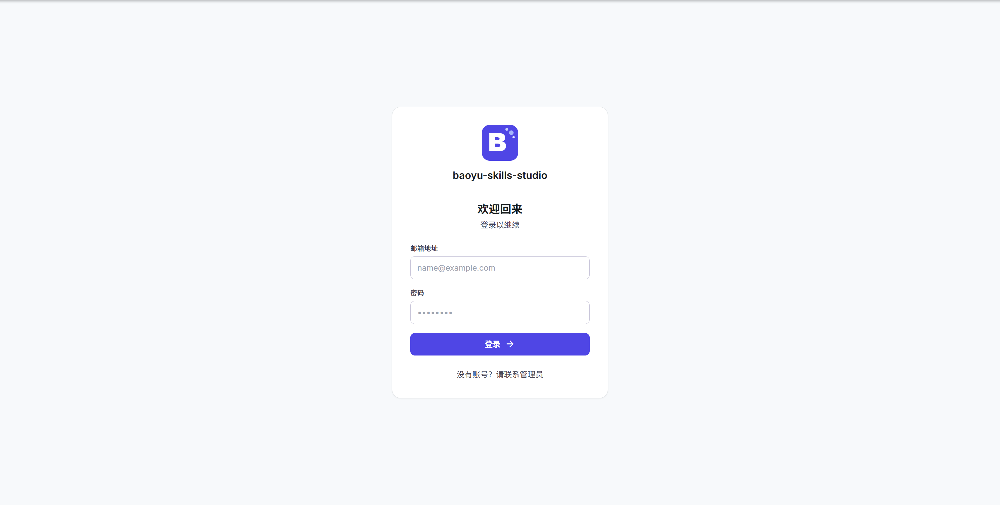

### Studio

| Cover Image | Infographic |
|:---:|:---:|
| 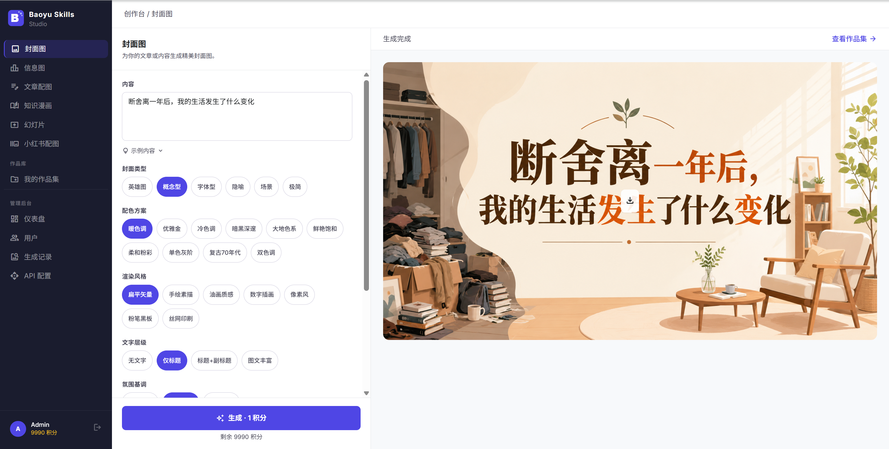 | 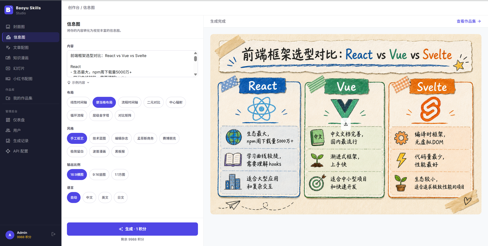 |

| Article Illustrator | Knowledge Comic |
|:---:|:---:|
| 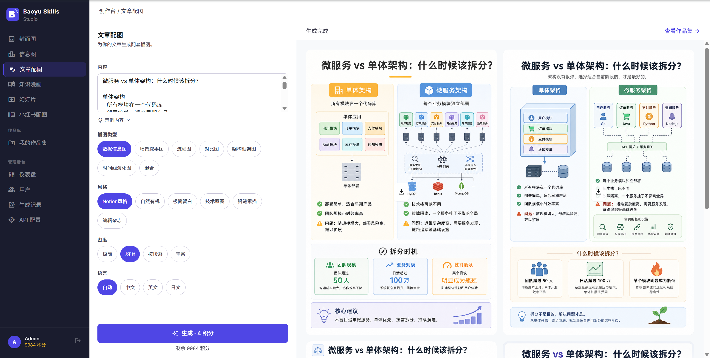 | 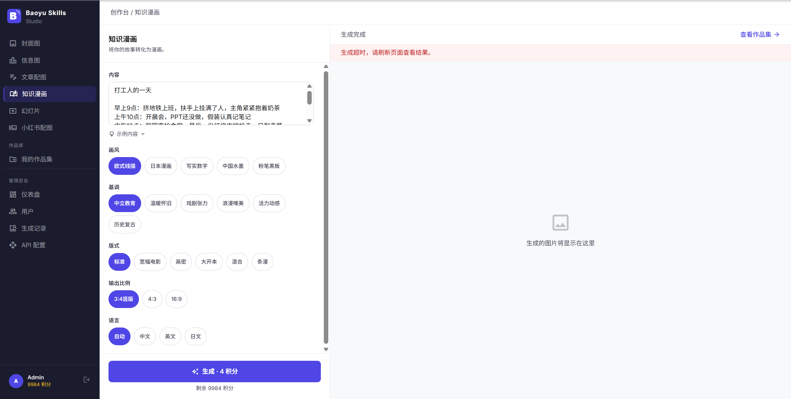 |

| Slide Deck | Xiaohongshu Images |
|:---:|:---:|
| 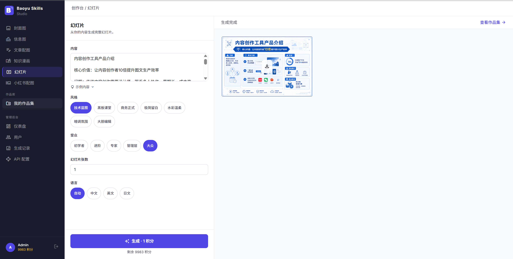 | 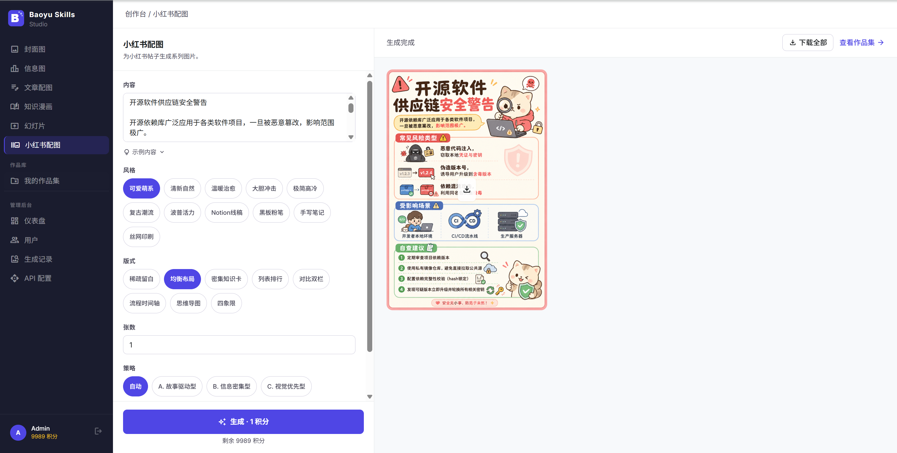 |

### Portfolio

<!-- 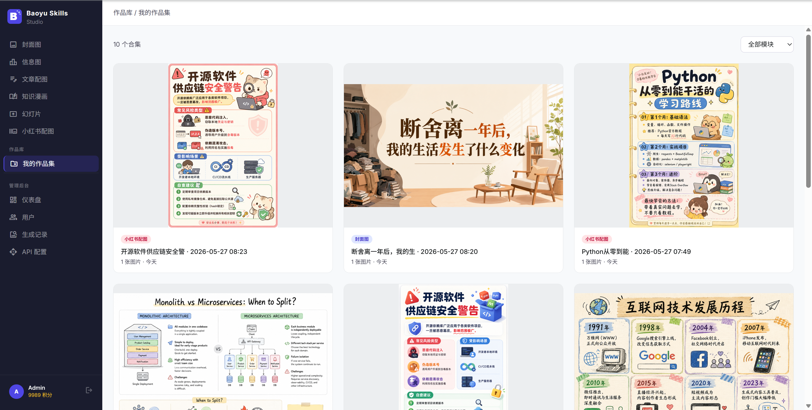 -->

### Admin Dashboard

| Dashboard | User Management |
|:---:|:---:|
| 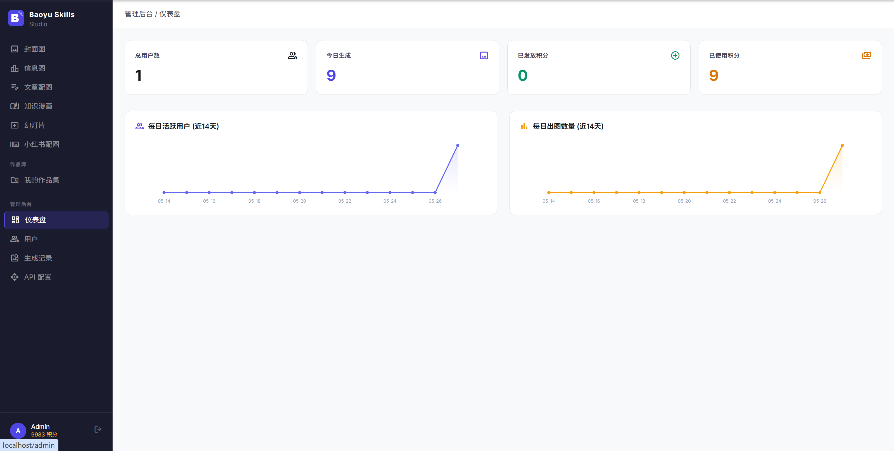 | 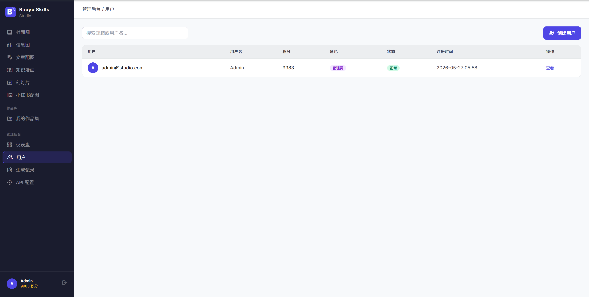 |

| Generation Records | API Config |
|:---:|:---:|
| 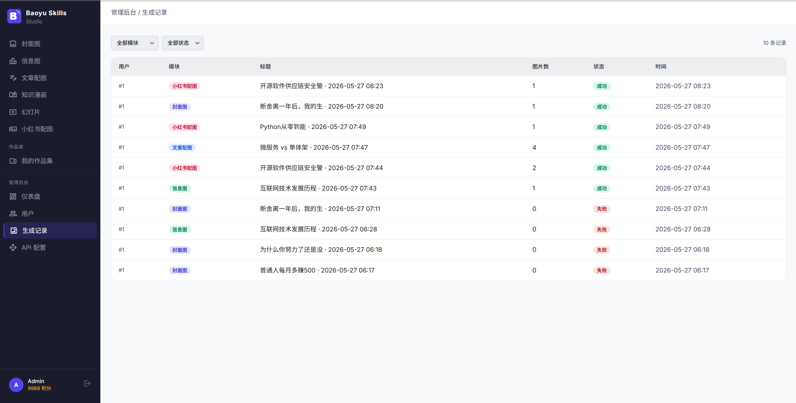 | 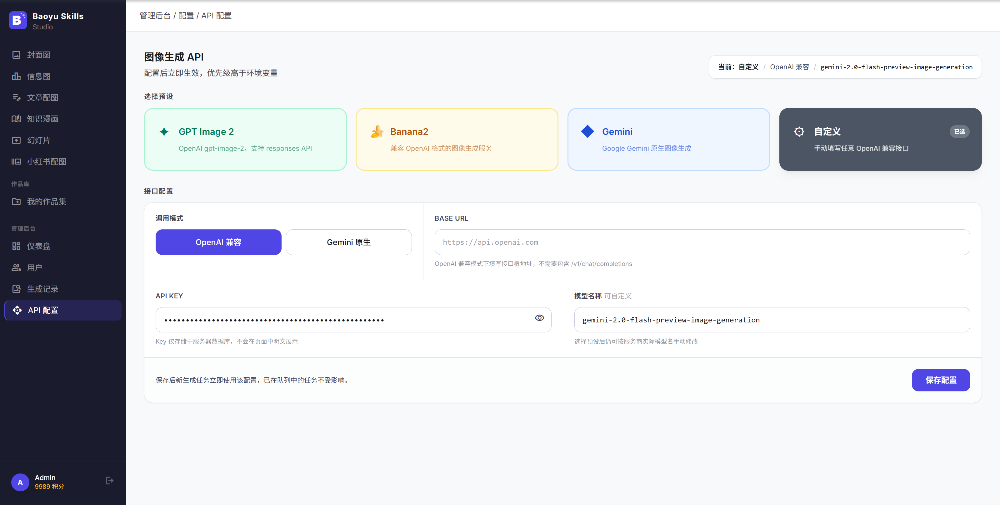 |

---

## Features

### Six Generation Modules

| Module | Description | Credits |
|---|---|:---:|
| Cover Image | Article / content covers, 10 color schemes × 7 rendering styles | 1 |
| Infographic | 8 layouts × 8 visual styles, landscape / portrait / square | 1 |
| Article Illustrator | Series of images by density (minimal / balanced / per-paragraph / rich) | 2–6 |
| Knowledge Comic | 5 art styles × 6 tones, multiple layouts | 4 |
| Slide Deck | 7 styles, 1–8 slides, each generated independently | 1 / slide |
| Xiaohongshu Images | 11 styles × 8 layouts, 1–6 image series | 1 / image |

### Credits System

- Each generation deducts the corresponding credits; generation is rejected when credits are insufficient
- Admins can add or deduct credits for any user, with an operation log
- Credit history is viewable in Admin → User Detail

### Portfolio Management

- Each generation task runs asynchronously; results are available in "My Portfolio"
- Filter by module, soft delete supported
- Full-screen preview and download on the detail page

### Admin Dashboard

- Dashboard: registered users, total generations, 14-day trend chart
- User management: search, enable / disable, credit adjustment, view details
- Generation records: full task list with status and error info
- API config: visually configure the image generation API (GPT Image 2, Banana2, Gemini, or any OpenAI-compatible endpoint); changes take effect immediately without restart

---

## Tech Stack

| Layer | Technology |
|---|---|
| Frontend | React 19 · Vite · TypeScript · TailwindCSS · Zustand |
| Backend | FastAPI · SQLAlchemy 2 · Alembic · PyMySQL |
| Database | MySQL 8.0 |
| Deployment | Docker Compose · Nginx |
| Image Generation | OpenAI-compatible API / Google Gemini native API |

---

## Project Structure

```
baoyu-skills-studio/
├── frontend/                  # React frontend
│   ├── src/
│   │   ├── pages/
│   │   │   ├── studio/        # 6 generation module pages
│   │   │   ├── portfolios/    # Portfolio list & detail
│   │   │   ├── admin/         # Admin (dashboard, users, records, API config)
│   │   │   └── auth/          # Login & register
│   │   ├── components/        # Shared UI components
│   │   ├── api/               # Axios request wrappers
│   │   ├── store/             # Zustand global state
│   │   ├── hooks/             # useGenerationPolling etc.
│   │   └── layouts/           # AppLayout (sidebar navigation)
│   └── nginx.conf             # Production Nginx config
├── backend/                   # FastAPI backend
│   ├── app/
│   │   ├── api/               # Routes (auth / generate / portfolios / admin)
│   │   ├── services/
│   │   │   ├── modules/       # Prompt building logic for each module
│   │   │   ├── image_gen_service.py   # Unified image service (OpenAI / Gemini)
│   │   │   ├── file_service.py        # Image persistence
│   │   │   └── credits_service.py     # Credits deduction
│   │   ├── models/            # SQLAlchemy ORM models
│   │   ├── schemas/           # Pydantic request / response models
│   │   └── core/              # Config, DB connection, JWT auth
│   ├── alembic/               # Migration scripts (001–007)
│   ├── scripts/
│   │   └── create_admin.py    # Initialize admin account
│   ├── init.sql               # Full DDL equivalent to alembic upgrade head
│   └── requirements.txt
├── docs/
│   └── screenshots/           # Product screenshots (referenced by README)
├── docker-compose.yml
├── .env.example               # Environment variable template
└── README.md
```

---

## Quick Start

### Option 1: Docker (Recommended)

**1. Prepare environment variables**

```bash
cp .env.example .env
```

Edit `.env` and fill in at least these fields:

```env
MYSQL_ROOT_PASSWORD=your_root_password
MYSQL_PASSWORD=your_studio_password
JWT_SECRET_KEY=your_long_random_secret    # 64-character random string recommended
IMAGE_MODEL_API_KEY=your_api_key
```

**2. Start services**

```bash
docker compose up -d
```

On first start, `alembic upgrade head` runs automatically — no manual migration needed.

**3. Initialize admin account**

```bash
docker compose exec backend python scripts/create_admin.py
```

Default admin credentials:

| Field | Value |
|---|---|
| Email | `admin@studio.com` |
| Password | `changeme` |

> **Change the password immediately after first login.**

**4. Access**

Open `http://localhost` (or the port set by `PORT` in `.env`).

---

### Option 2: Local Development

#### Frontend

```bash
cd frontend
npm install
npm run dev        # http://localhost:5173
```

#### Backend

```bash
cd backend
pip install -r requirements.txt
cp .env.example .env    # fill in DB connection and API key
alembic upgrade head    # create tables
uvicorn main:app --port 8700 --reload
```

The Vite dev server proxies `/api` and `/output` to `http://localhost:8700`.

---

## Environment Variables

Docker deployment uses the root `.env`; local development uses `backend/.env` (same fields).

```env
# ── MySQL (required for Docker) ──────────────────────────
MYSQL_ROOT_PASSWORD=change_me_root
MYSQL_DATABASE=baoyu_studio
MYSQL_USER=studio
MYSQL_PASSWORD=change_me_studio

# ── Backend ──────────────────────────────────────────────
DATABASE_URL=mysql+pymysql://studio:change_me_studio@db/baoyu_studio
JWT_SECRET_KEY=your-very-long-random-secret   # at least 32 characters

# ── Image Generation API (can also be configured in admin UI) ──
IMAGE_API_MODE=openai              # openai | gemini
IMAGE_MODEL_BASE_URL=              # OpenAI-compatible endpoint; leave empty for Gemini
IMAGE_MODEL_NAME=gpt-image-2
IMAGE_MODEL_API_KEY=your_api_key

# ── Other ────────────────────────────────────────────────
FRONTEND_URL=http://localhost      # CORS allowlist; set to actual access URL
PORT=80                            # Exposed port
```

> **API config priority**: values saved in the admin dashboard override `.env`. Changes take effect immediately without restarting containers.

---

## Docker Services

| Service | Description |
|---|---|
| `db` | MySQL 8.0, data persisted to `db_data` volume |
| `backend` | FastAPI, port exposed only inside the container (8700); generated images stored in `output_data` volume |
| `frontend` | Nginx serving the React build, reverse-proxying `/api` and `/output` to the backend, exposing `PORT` externally |

---

## Supported Image Generation APIs

The admin API Config page provides one-click presets and also accepts any OpenAI-compatible endpoint.

| Preset | Mode | Notes |
|---|---|---|
| GPT Image 2 | OpenAI-compatible | Official `api.openai.com`, `gpt-image-2` model |
| Banana2 | OpenAI-compatible | Third-party OpenAI-compatible image generation service |
| Gemini | Gemini native | Google `gemini-2.0-flash-preview-image-generation` |
| Custom | Any | Manually enter Base URL, API Key, and model name |

---

## Database Migrations

The project uses Alembic; the latest version is `007`.

```bash
# Upgrade to latest
alembic upgrade head

# Check current version
alembic current

# Roll back one step
alembic downgrade -1
```

For a fresh deployment you can also import `backend/init.sql` directly, which is equivalent to `alembic upgrade head`.

---

## Deployment Notes

- **China network**: `Dockerfile` uses `docker.m.daocloud.io/` mirror prefixes so images can be pulled without a proxy.
- **bcrypt compatibility**: `requirements.txt` pins `bcrypt==4.2.1`. bcrypt 5.x is incompatible with passlib 1.7.4 — do not upgrade across major versions.
- **Generation timeout**: image API requests time out after 300 seconds; slow responses from some models are expected.
- **Image storage**: generated images are stored in the `output_data` Docker volume and served via Nginx at `/output`.

---

## License

MIT
